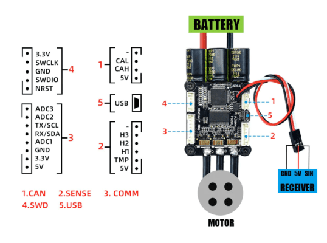

# Use of the product

## Connection diagram

## Port Descriptions:

| Port | Feature |
|----------------------------|--------------------------------------------------------------------------------------------------------------------------------------------------------------------------------------------------------------------------------------------|
|1)  CAN | Controller Area Network (CAN) is a port for the bus system. CAN is a network protocol used especially in vehicles that allows many different electronic control units (ECUs) to communicate with each other.
2 )SENSE | This input is used to read signals from sensors that usually detect the status of the motor or battery. For example, a temperature sensor can be connected here to check if the motor or battery is overheating.
| 3)COMM| This is the port used for communication. The RX/SDA and TX/SCL labels indicate that this port has I²C serial data (SDA) and serial clock (SCL) lines. I²C is a protocol that allows data exchange between the microcontroller and other I²C compatible devices.
|4 ) SWD | The Serial Wire Debug (SWD) port is used for programming and debugging the microcontroller. The SWCLK (Serial Wire Clock) and SWDIO (Serial Wire Data I/O) pins are required for data transfer and synchronization during programming and debugging.
|5 ) USB | This is the Universal Serial Bus (USB) port and is used for programming or exchanging data with a PC.|

## Pin Descriptions
 
| CAN Port | Feature |
|----------------------------|--------------------------------------------------------------------------------------------------------------------------------------------------------------------------------------------------------------------------------------------|
|CAL | This pin is usually used for calibration.
CAH |Usually available for calibration or tuning lines.
|5V| 5 volt power output provided via USB.
**SENSE Port** | **Feature** |                                                          
|H3, H2, H1 | These pins are usually used for communication with external devices. Their specific function may vary depending on the board design and the protocol used.
TMP is the input pin for a temperature sensor.
|5V |5 volt output that powers the port.
|**COMM Port** | **Feature** |                                               
|ADC3, ADC2, ADC1 | Analog-to-Digital Converter, i.e. analog-to-digital converter inputs. It takes analog signals from external sensors and converts them into digital signals that the microcontroller can process.
RX/SDA | This pin functions as both UART receiver (RX) and I²C data line (SDA).
TX/SCL |: This pin functions as both UART transmitter (TX) and I²C clock line (SCL).
|GND| GND|
|3.3V|3.3 volt output providing power to the port.
|5V|5 volt output to power the port.
**SWD Port** | **Feature** |
|3.3V |3.3 volt output that powers the port.
SWCLK |Serial Wire Clock, the serial clock line. Provides the clock signal for SWD (Serial Wire Debug).
|GND| GND|
|SWDIO| Serial Wire Debug Data I/O, i.e. serial data input/output line. Provides data transfer for SWD.
|NRST|Reset pin. A reset signal can be sent to the microcontroller through this pin.

:::info
A schematic of the VESC 6.7 70A High Power Motor Driver can be made here with a battery and suibo with our thrusters saying degz on ours. In the title we say use with suibo.
:::

## Ready to stabilize with Gyro

VESC IMU is suitable for use with single-wheeled vehicles that provide accelerometry with the VESC IMU.

<iframe width="100%" height="574" src="https://www.youtube.com/embed/iGgNuo6o_Ug" title="VESC IMU Accelerometer Calibration - How To" frameborder="0" allow="accelerometer; autoplay; clipboard-write; encrypted-media; gyroscope; picture-in-picture; web-share" allowfullscreen></iframe>

## Setting for VESC board

You can watch below how to program Vesc for electric skateboards.

<iframe width="100%" height="574" src="https://www.youtube.com/embed/lDuV8cnPRmI" title="VESC® Tool 2020 Tutorial - How to Program Vesc for DIY Electric Skateboards" frameborder="0" allow="accelerometer; autoplay; clipboard-write; encrypted-media; gyroscope; picture-in-picture; web-share" allowfullscreen></iframe>

**You can reach us through the [forum](https://forum.degzrobotics.com/) for questions and suggestions**