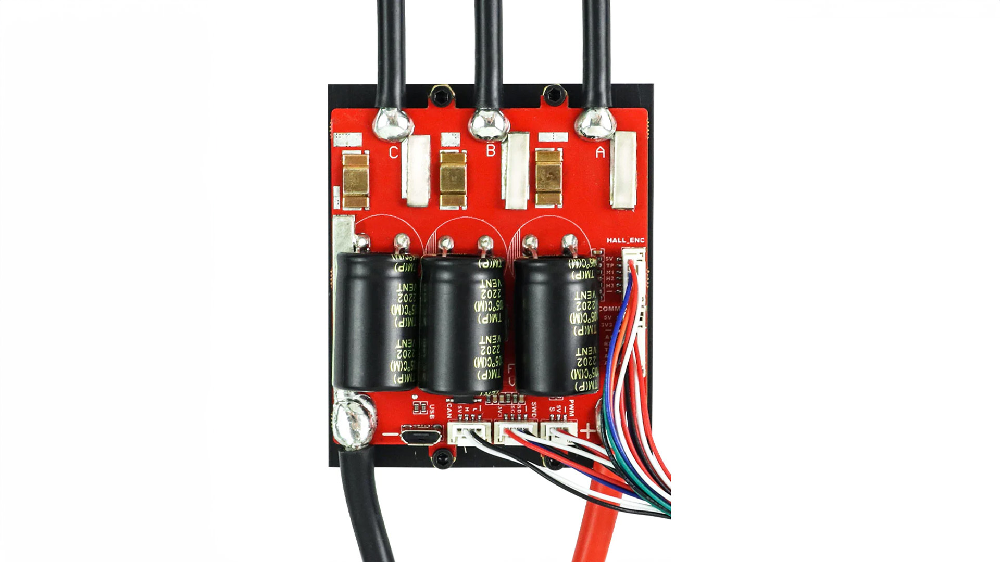

import DocCardList from '@theme/DocCardList';

# VESC 6.9 100A(Max 200A) High Power Motor Driver- Flipsky

VESC is an open source motor drive that can operate in a voltage range from 14V to 60V and can provide 100A continuous and up to 200A instantaneous current. With a variety of control modes, it supports DC, BLDC and FOC (sinusoidal) modes and offers energy recovery with regenerative braking. VESC has USB, CAN and UART ports, is compatible with sensors such as ABI, HALL, AS5047 and is programmable. Measuring 75.4×63.7×31.1mm, this driver is equipped with various protection functions such as low and high voltage protection, overcurrent and high temperature protection and supports accelerometer modules, offering a wide range of applications for your electric vehicle projects.

## Product Features 
| Feature | Value |
|----------------------------|--------------------------------------------------------------------------------------------------------------------------------------------------------------------------------------------------------------------------------------------|
| Continuous current | 100A
| Instantaneous current | 200A
| Voltage | 14V-60V (Cells: 4-13S; safe for 4S to 12S, voltage - spikes must not exceed 60V!) |
| BEC | 5V @ 1A ERPM: 150000 Control |
| Interface Ports | USB, CAN, UART
| Supported Sensors | ABI, HALL, AS5047, AS5048A
| Input Set Support | PPM, ADC, NRF, UART, SPI, IIC Modes: DC, BLDC, FOC - (sinusoidal)
| Regenerative capacity | Yes |
| Programmable | Yes |
| Motor cable | 10AWG
| Power cable | 8AWG
| Size | 75.4×63.7×31.1mm (including heat sink)
| Features | Four Control Modes: Current / Duty Cycle / Speed / Position - control mode. |
| Protection functions: undervoltage protection, overvoltage protection, over-current protection, over-temperature protection, over-temperature protection of MOSFETs. Supports accelerometer measurement unit modules such as MPU9250, MPU9150, MPU6050, LSM6DS3, BMI160. |

:::info
It is recommended to use the factory firmware version 5.2, new firmware update may damage the ESC.
:::

## Comprehensive Driver Tuning Software VESC Tool

You can easily program your motor driver with VESC interface.
You can use [this link](https://vesc-project.com/vesc_tool) to download the programmer.

**To buy this product [click here](https://degzrobotics.com/product/vesc-6-6-yuksek-guclu-motor-surucu-flipsky/).** 

<DocCardList />
