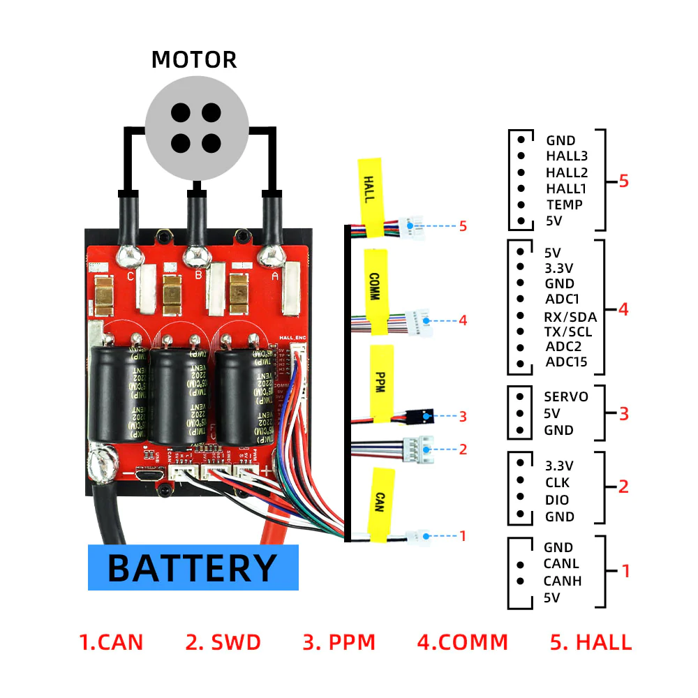

# Use of the product

## Connection diagram

## Port Descriptions:

| Port | Feature |
|----------------------------|--------------------------------------------------------------------------------------------------------------------------------------------------------------------------------------------------------------------------------------------|
|1)  CAN | Controller Area Network (CAN) is a port for the bus system. CAN is a network protocol used especially in vehicles that allows many different electronic control units (ECUs) to communicate with each other.
|2) SWD | Serial Wire Debug (SWD) port is used for programming and debugging the microcontroller. SWCLK (Serial Wire Clock) and SWDIO (Serial Wire Data I/O) pins are required for data transfer and synchronization during programming and debugging.
3 )PPM | PPM (Pulse Position Modulation) signal is a type of signal used especially in remote control systems. It is used to control devices such as servo motors.
| 4)COMM | This is the port used for communication. The RX/SDA and TX/SCL labels indicate that this port has I²C serial data (SDA) and serial clock (SCL) lines. I²C is a protocol for exchanging data between the microcontroller and other I²C compatible devices.
|5 ) HALL | Hall sensor inputs are used for sensors that enable the detection of magnetic fields. These ports are commonly used to sense the rotor position of brushless motors.

## Pin Descriptions
 
| CAN Port | Feature |
|----------------------------|--------------------------------------------------------------------------------------------------------------------------------------------------------------------------------------------------------------------------------------------|
|CAL | This pin is usually used for calibration.
CAH |Usually available for calibration or tuning lines.
|5V| 5 volt power output provided via USB.
|GND| GND 
| **SWD Port** | **Feature** |
|3.3V |3.3 volt output that powers the port.
SWCLK |Serial Wire Clock, the serial clock line. Provides the clock signal for SWD (Serial Wire Debug).
|GND| GND|
|SWDIO| Serial Wire Debug Data I/O, i.e. serial data input/output line. Provides data transfer for SWD.
|**COMM Port** | **Feature** |
|ADC15, ADC2, ADC1 | Analog-to-Digital Converter, i.e. analog-to-digital converter inputs. It takes analog signals from external sensors and converts them into digital signals that the microcontroller can process.
RX/SDA | This pin functions as both UART receiver (RX) and I²C data line (SDA).
TX/SCL |: This pin functions as both UART transmitter (TX) and I²C clock line (SCL).
|GND| GND|
|3.3V|3.3 volt output providing power to the port.
|5V|5 volt output to power the port. 
**HALL Port** | **Feature** |
|H3, H2, H1 | These pins are usually communication ports and are used for data communication with external devices. Their specific function may vary according to the design of the board and the requirements of the project.
TMP | Used to receive the data output of the temperature sensor.
|5V| This port provides a 5 volt power supply. It is used to supply other devices or components.| |

:::info
A schematic of the VESC 6.7 100A High Power Motor Driver with our thrusters and a battery and suibo with our degz on it can be made here. In the title we say use with suibo.
::: 

## Ready to stabilize with Gyro (English content)

VESC IMU is suitable for use with single-wheeled vehicles that provide accelerometry with the VESC IMU.

<iframe width="100%" height="574" src="https://www.youtube.com/embed/iGgNuo6o_Ug" title="VESC IMU Accelerometer Calibration - How To" frameborder="0" allow="accelerometer; autoplay; clipboard-write; encrypted-media; gyroscope; picture-in-picture; web-share" allowfullscreen></iframe>

## Setup for VESC board (English Content)

You can watch below how to program Vesc for electric skateboards.

<iframe width="100%" height="574" src="https://www.youtube.com/embed/lDuV8cnPRmI" title="VESC® Tool 2020 Tutorial - How to Program Vesc for DIY Electric Skateboards" frameborder="0" allow="accelerometer; autoplay; clipboard-write; encrypted-media; gyroscope; picture-in-picture; web-share" allowfullscreen></iframe>