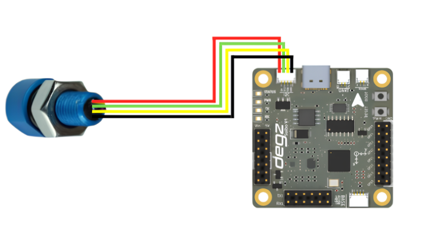

# Use of the product


## D300 Pressure, Temperature, Depth, and Altitude Sensor Data Reading Code

This code uses the Arduino and the D300 Depth and Water Temperature Sensor (MS5837 model) to measure pressure, temperature, depth, and altitude in underwater environments. The MS5837 sensor accurately measures the physical properties of water and transmits the data via the Arduino's serial port.

During setup, serial communication is initiated at 9600 baud, and the I2C connection is established. The sensor's initialization checks for any connection errors. Once successfully initialized, the sensor model and water density are configured, preparing it for measurements.

In the main loop, the sensor is continuously read, and the obtained pressure, temperature, depth, and altitude values are printed to the serial port. A one-second delay is added after each reading to maintain a consistent data flow. This code is ideal for underwater research, diving technologies, maritime applications, or environmental monitoring projects. The continuous and reliable recording of data is crucial for analysis and monitoring activities.





````
#include <Wire.h>
#include "MS5837.h"

MS5837 sensor;

void setup() {
  Serial.begin(9600); // Start serial communication at 9600 baud.
  
  Serial.println("Starting"); // Send start message through serial port.
  
  Wire.begin(); // Start I2C connection.

  // Initializing sensor. If it fails, print error message.
  while (!sensor.init()) {
    Serial.println("Initialization failed!"); // Initialization failed.
    Serial.println("Are SDA/SCL correctly connected?"); // Check if SDA/SCL are correctly connected.
    Serial.println("Degz Robotics Bar30: Yellow=SDA, Green=SCL"); // Correct information: Yellow=SDA, Green=SCL
    Serial.println("\n\n\n"); // Add extra blank lines.
    delay(5000); // Wait for 5 seconds.
  }
  
  sensor.setModel(MS5837::MS5837_30BA); // Set sensor model.
  sensor.setFluidDensity(997); // Set fluid density (997 kg/m^3 for freshwater, 1029 for seawater).
}

void loop() {
  // Update pressure and temperature readings.
  sensor.read();

  // Print pressure information to serial port.
  Serial.print("Pressure: "); 
  Serial.print(sensor.pressure()); 
  Serial.println(" mbar");
  
  // Print temperature information to serial port.
  Serial.print("Temperature: "); 
  Serial.print(sensor.temperature()); 
  Serial.println(" degrees C");
  
  // Print depth information to serial port.
  Serial.print("Depth: "); 
  Serial.print(sensor.depth()); 
  Serial.println(" m");
  
  // Print altitude information to serial port.
  Serial.print("Altitude: "); 
  Serial.print(sensor.altitude()); 
  Serial.println(" m above sea level");

  delay(1000); // Wait for 1 second.
}
````
