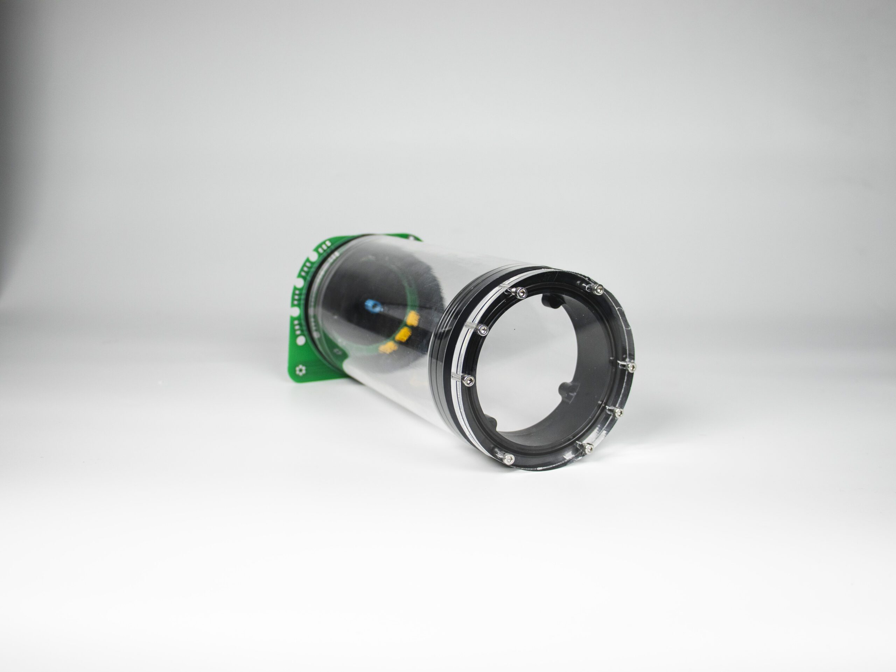
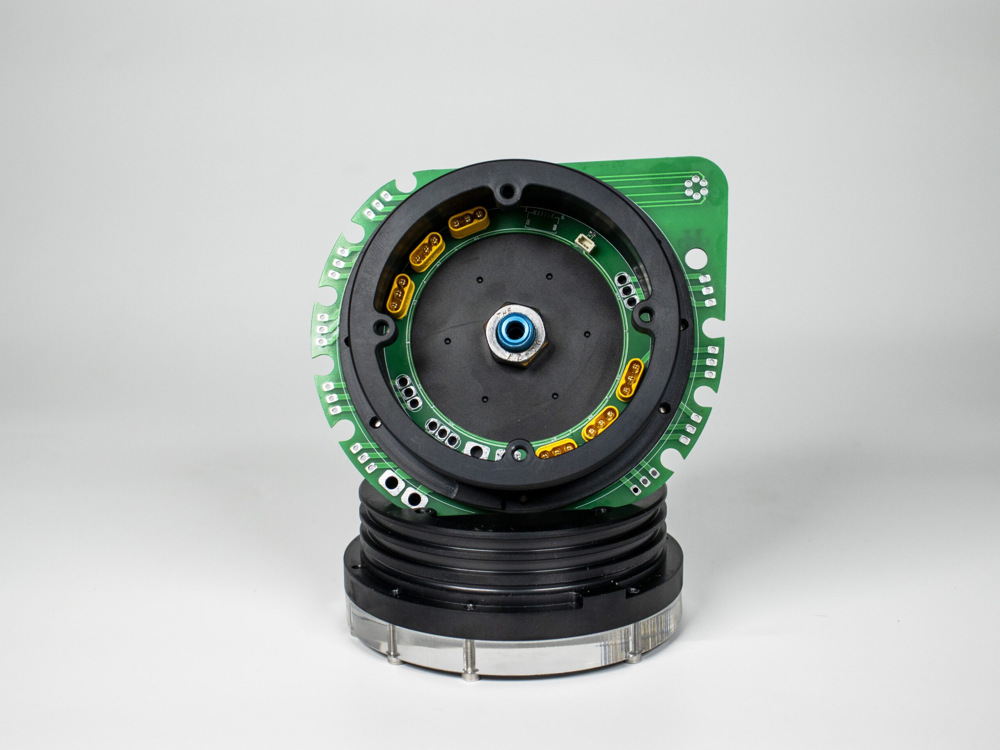

# About the Product

The H-100 Underwater Chamber has been designed with the experience of a successful chamber series and equipped with additional features specific to your underwater projects. Details such as a redesigned PCB connector assembly, special lock design and designated guides for the penetrator hole make this chamber unrivaled in terms of ease of intervention and durability.

Technical features include inner diameter, outer diameter, saltwater material, and patented transmission technology.

- Redesigned PCB connector assembly for ease of intervention
- Special lock design to prevent the hopper lid from rotating
- Predetermined guides for easy penetrator drilling

## Technical Specifications

- Inner Diameter 90mm
- Outer Diameter 100mm
- Suitable for use in salt water
- Anodized aluminum and chrome material
- 150 - 200 meters maximum depth*
- Patented transmission technology
- Fewer sealing elements (4 per cover including transfers)
- Up to 8 motors output(24 Pin) / 8pin communication line / 4 pcs(8 pin) - switching channel line
- Maximum depth varies according to the chamber length.

## Box Contents

- Acrylic Bowl
- H100 Flange (2 pcs)
- H100 Cover
- H100 Windshield Acrylic
- H100 Transponder Card
- Cable Penetrator
- 3×82 O-ring (7 pcs)
- 3ML Special Grease Oil
- M3x16 Imbus Bolt (14 pcs)

## Weights

Front Aluminum Flange - 290g

250mm Hopper

Rear Aluminum Flange - 300g

250mm acrylic - 430g

300mm acrylic - 520g

350mm acrylic - 610g

## Sensors

The pressure and temperature sensor (MS5837), which must come into contact with water, is located on the outer surface of the transponder board. The hall effect sensor used to switch the base module is located on the part of the transponder board facing into the reservoir. The outputs of the sensors are determined as Blue +3,3V Black Gnd Green SDA White SCL for the pressure sensor. For Hall effect sensor; yellow Vout Black Gnd Red Vin.

## Chamber assembly guide

When the chamber is first prepared for use, all o-ring seals should be lubricated with silicone liquid grease. This will prevent wear of the seals by reducing friction, especially on the parts in contact with acrylic. On the other hand, silicone grease will ensure a better fit of the O-Ring to the surface.

When tightening the screws of the reservoir, make sure that all screws are tightened at the same rate. Afterwards, be sure to check the position of the lid, if there is any slant in the lid, open it again and check whether there is an object stuck in between. This is easier to check visually on the front cover. When tightening the screws, check how much the gaskets are crushed.

<iframe width="100%" height="574" src="https://www.youtube.com/embed/wks-8iuaIAI" title="Degz Underwater Reservoir" frameborder="0" allow="accelerometer; autoplay; clipboard-write; encrypted-media; gyroscope; picture-in-picture; web-share" allowfullscreen></iframe>

:::info
The hopper in the related video belongs to the old version.
:::

::::warning
Protect the reservoir from being dropped, hit by hard objects, high temperatures and jams. When you add a battery to the reservoir, do not fix the covers so that they cannot be opened in case of explosion. Without covering the transponder card, you can test it in fresh water with devices that do not work with high current for no more than half an hour, but after the tests, remove the outer cover on the back ring, dry it and cover the surface absolutely. Chlorinated water can damage aluminum, avoid prolonged use in pools. After immersing the reservoir in salt water, soak it in fresh water each time to remove any salt remaining on the surface.
:::

<iframe width="100%" height="574" src="https://www.youtube.com/embed/GYWZvBBVTVA" title="Innovative Transfer Method | Degz Underwater Hopper H-100" frameborder="0" allow="accelerometer; autoplay; clipboard-write; encrypted-media; gyroscope; picture-in-picture; web-share" allowfullscreen></iframe>