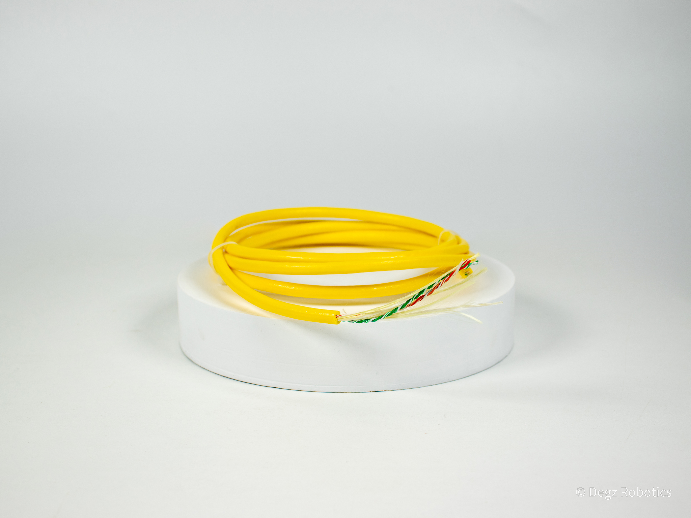

import DocCardList from '@theme/DocCardList';

# About the Product

4 Pin Twisted Pair Communication Cable is a communication cable with high strength and neutral buoyancy, especially preferred in underwater working areas.

Thanks to the polyurethane outer sheath, it has high strength and high flexibility. The polyurethane sheath is much more resistant to breakage and tearing than other types of materials.

The cable contains Kevlar wires for strength and Dacron fibers for gap filling. Dacron fibers are combined with a water blocking compound to prevent leaks from nicks or tears in the cable. The high visibility yellow polyurethane foam sheath is abrasion resistant and provides neutral buoyancy.

The flexibility of the cable is designed to be high enough to give Deringezens plenty of freedom, but stiff enough not to tangle easily.

## Technical Specifications

| Feature | Value | |
|------------------------------|------------------------|---------------|
| Outer Coating | Polyurethane | |
| Inner Wire Thickness | 26 AWG | |
| Diameter | 6 mm | 0.23 in |
| Length | 30 - 200 m | 100 - 650 ft |
| Operating Strength | 45 kgf | 100 lbf |
| Crushing Strength | >100 kg/f | 220 lbf |
| Minimum Working Bending Diameter | 75mm | 25mm |
| Fresh Water Buoyancy | Neutral | |
| Buoyancy in Salt Water | Slightly Positive | |
| Conductors | 2 Pair Twisted, 26 AWG | | |
| Electrical Properties | | |
| DC Resistance @ 20°C | 0.127 Ω/m | 0.146Ω/m |
| Insulation Resistance @ 500 VDC | > 1640 MΩ/km | - |
| Voltage rating | 300 VDC | | |

**You can reach us through the [forum](https://forum.degzrobotics.com/) for questions and suggestions**
<DocCardList />