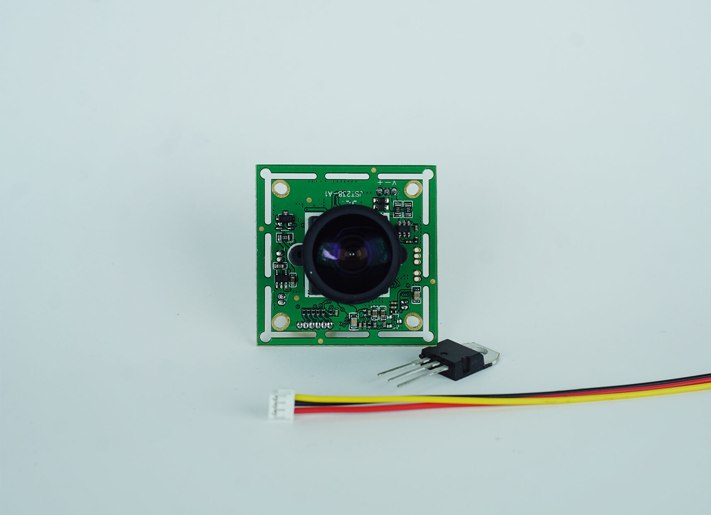
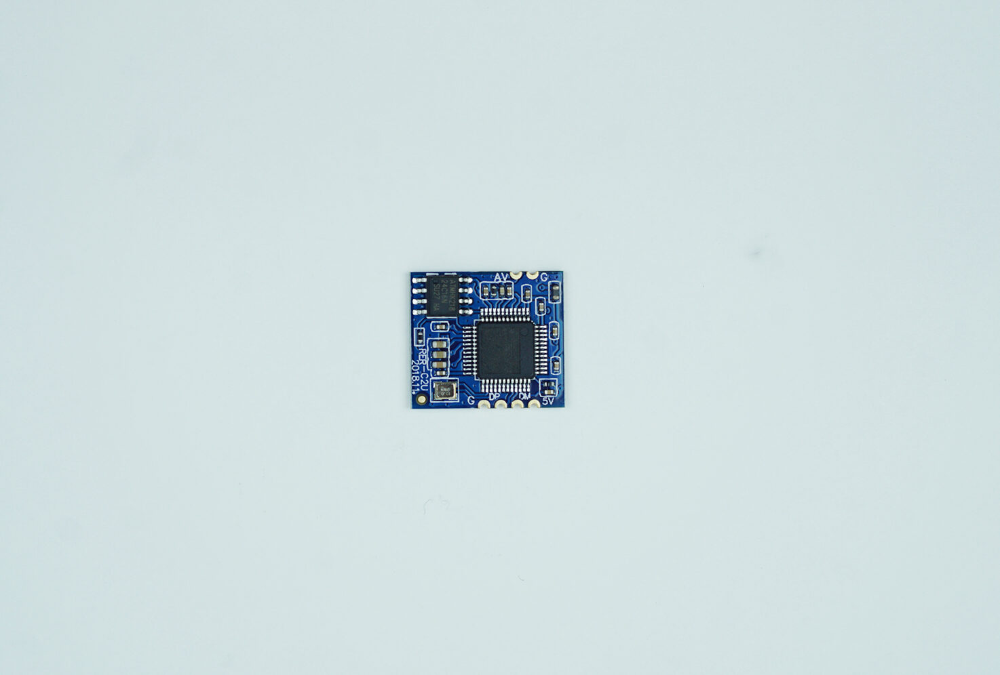

import DocCardList from '@theme/DocCardList';

# About the Product

The 1200TVL Analog Camera is a prominent choice with its low latency and cost advantages in critical robotic systems.

Known for their resistance to electromagnetic noise, these cameras will not interrupt or delay in the event of any noise, but this can affect image quality.

Cables that transmit analog images are severely affected by electromagnetic noise. If this cable runs next to a power line (especially if there is a high current flow through the cable), it is very useful to have an outer shield (a lattice made of metal woven into the cable) of the cable that transmits the signal.

**You can reach us through the [forum](https://forum.degzrobotics.com/) for questions and suggestions**

<DocCardList />