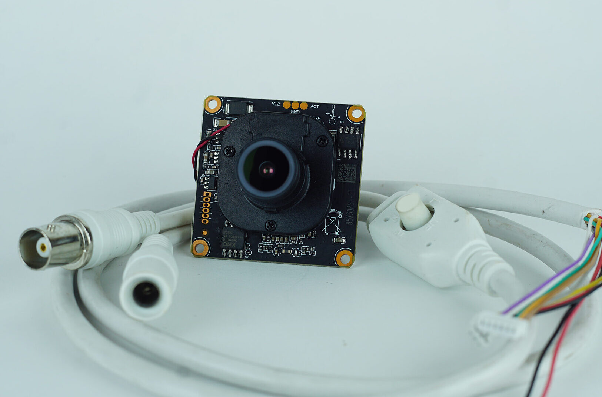
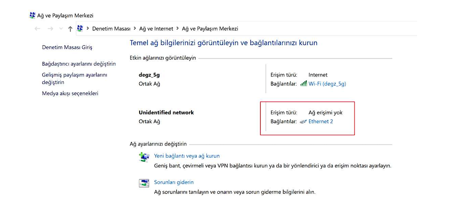
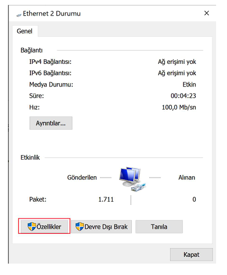
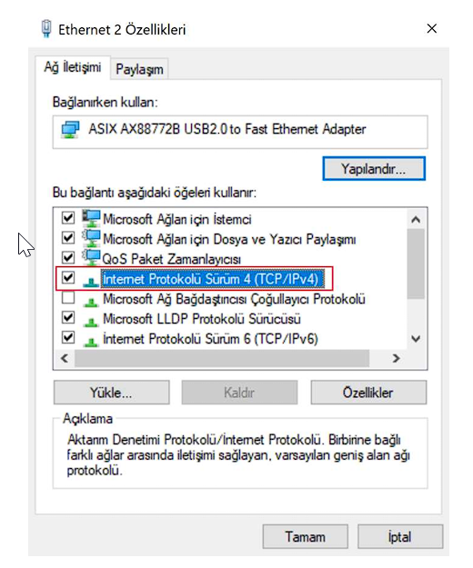
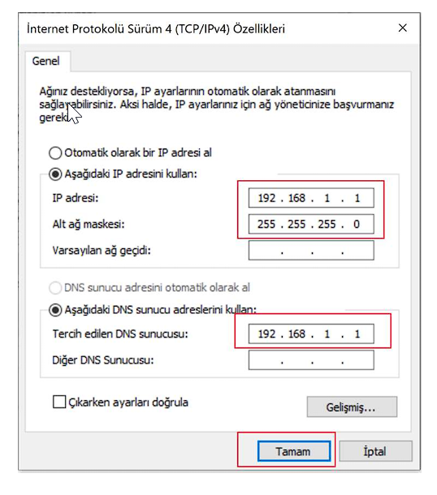
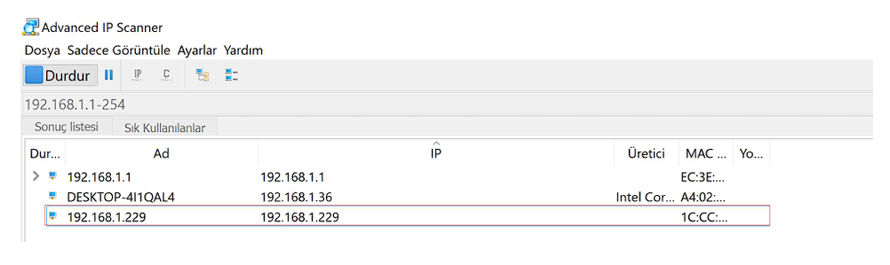

# IP Camera Connection Guidelines

Guide to make connection for Degz IP Camera.

1. From the Network and Sharing Center, click on Ethernet in the connections on the wired network.

2. In the window that opens, click on Properties.

3. Click on the description where IPV4 is located and then click on Properties (missing in the picture)

4. Enter the IP values from the picture and click OK and then click OK.

5. We find the IP Camera address using an IP scanning program like Advanced IP Scanner.

You can then view your camera image using an IP camera decoder software (e.g. IP Camera Viewer) or by entering this address in a browser.

:::info

Camera access passwords are one of the following combinations.

| # | Username | Password |
|---|---------------|--------|
| 1 | admin | admin |
| 2 | empty         | empty |
| 3 | admin | 123456 |
| 4 | admin | empty  |

:::

[click here](https://degzrobotics.com/wp-content/uploads/2022/04/IP-Kamera.pdf).
