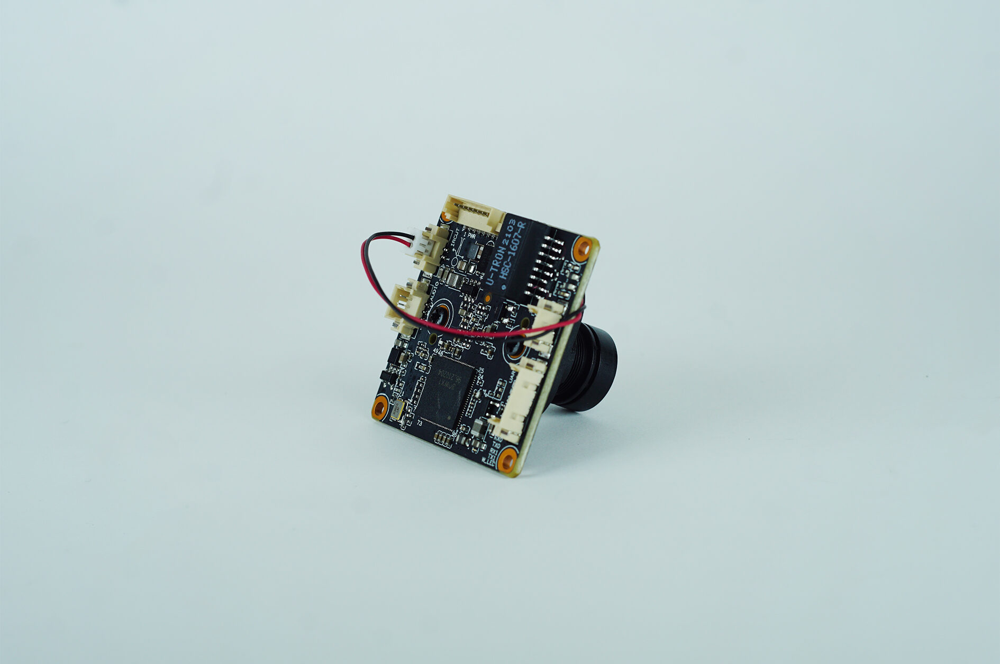

import DocCardList from '@theme/DocCardList';

# About the Product

IP Cameras are high resolution cameras that work with packet protocols. 

They transmit the image using a packet structure with a microcontroller built in. IP cameras are affected by interference similar to analog cameras, but this never results in degradation of image quality.

 Noise on the line causes packets to be delayed, which is reflected in a delayed image. Since IP Class Cat5-6 cables are twisted pair, the effect of interference is lower than analog cameras. Cat 6e or Cat 7 cable type can be preferred to reduce the interference effect.

**You can reach us through the [forum](https://forum.degzrobotics.com/) for questions and suggestions**

<DocCardList />