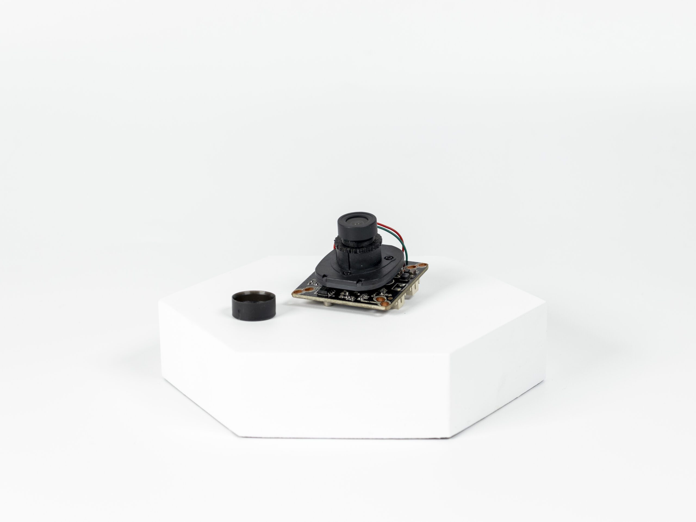

import DocCardList from '@theme/DocCardList';

# About the Product

Experience high resolution in the most efficient way! The analog HD camera system offers low latency (approximately 100ms) image transmission up to 300 meters with low cost.

Its simple and solution-oriented structure promises higher performance than standard analog camera resolution, but requires integration with special resolvers. An interchangeable lens option allows you to achieve the desired viewing angle. Analog HD cameras are sensitive to noise, so shielded cables are recommended, but unshielded cables can also be used if there is no interference to the signal line. Specifications include 1920×1080 resolution, >100ms delay, interchangeable M12 lens type and 12V supply voltage. Discover clear and uninterrupted viewing experience with AHD camera!

## Meet High Resolution

Combining low cost and high resolution, the AHD camera system can transmit images with low latency (up to 100ms) up to 300 meters over standard coaxial cables.

## Simple and Solution Oriented

While AHD Cameras promise a higher resolution than standard analog camera resolution, they cannot be used with standard analog camera resolvers. Special camera resolvers are required for AHD Cameras. Since it requires a simpler system structure than IP cameras, it is often used in robotic areas where higher resolution than analog cameras is required.

## Interchangeable Lens

With interchangeable lenses, you can transfer images with wide angle or standard viewing angle.

:::warning
AHD Cameras can be affected by noise like analog cameras, so it would be appropriate to transfer the image with shielded cables similar to analog cameras. However, it can also be used with unshielded cables if there are no factors that can disturb the signal line.
:::

**You can reach us through the [forum](https://forum.degzrobotics.com/) for questions and suggestions**

<DocCardList />
