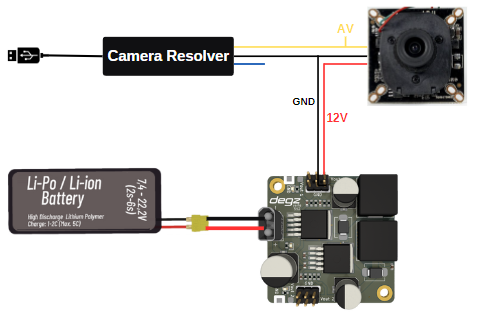

# Use  of the Product

## Analog Camera Pin Diagram

The observed schematic diagram displays the fundamental connections of an Analog High Definition (AHD) camera. The camera's video output (AV) connects to the corresponding input terminal of the camera decoder via a yellow cable. The red cable carries the 12 Volt DC supply voltage, meeting the camera's power requirements. The black cable establishes the system's ground (GND) connection, ensuring electrical circuit integrity and minimizing potential noise.

In addition to the schematic diagram, the blue output terminal of the camera decoder is designed to provide power for cameras that operate with 5 volts. If the camera that will be connected to the system operates on 5 volt DC supply voltage, the necessary energy can be supplied through this output. Furthermore, when the camera decoder is directly connected to a computer via a USB interface, it becomes possible to receive and process the camera's video data. This feature offers significant comfort and accessibility, allowing users to monitor camera images in real time.

## Analog Camera and Voltage Regulator Connection Diagram

## Product usage video

<iframe width="100%" height="574" src="https://www.youtube.com/embed/gdNUwNv4al0" title="ANALOG HD (AHD) KAMERALAR NASIL KULLANILIR" frameborder="0" allow="accelerometer; autoplay; clipboard-write; encrypted-media; gyroscope; picture-in-picture; web-share" allowfullscreen></iframe>

**You can reach us through the [forum](https://forum.degzrobotics.com/) for questions and suggestions**