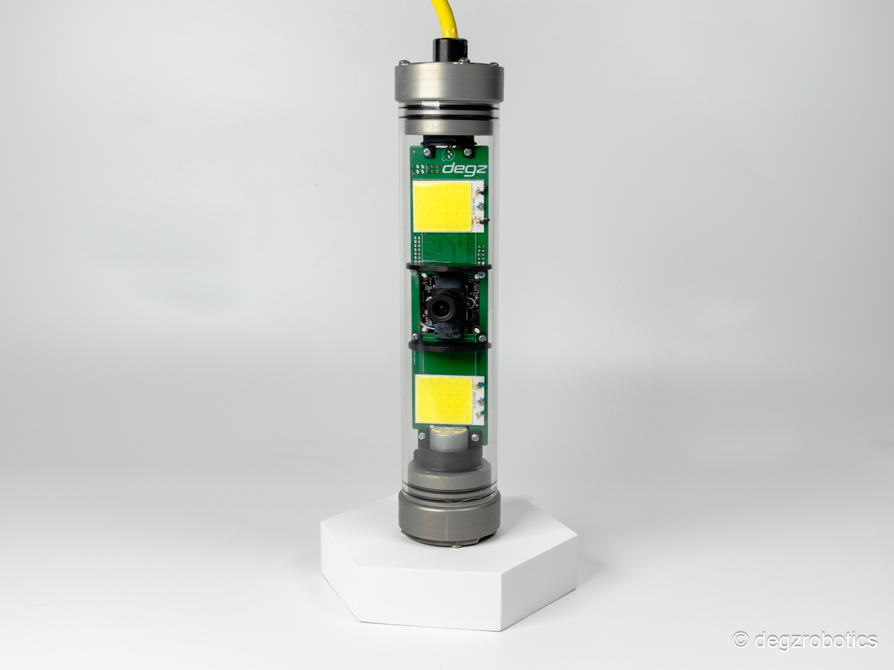
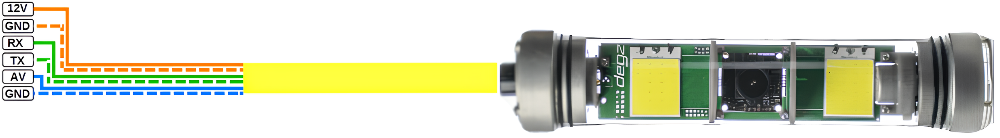

import DocCardList from '@theme/DocCardList';

# About the Product

The Rolica Motion Camera System provides superior imaging even in dark environments with a 180-degree free rotation angle and 1000lm illumination intensity. Operating with standard PWM signals, this system is compatible with all camera modules within Degz, allowing users to easily adjust the camera direction. With a 12V operating voltage and a maximum depth capacity of 150 meters, Rolica offers a flexible and scalable solution. The system does not include a camera and can be customized with optional additional camera modules.

## Product Technical Specifications
|Features	|Description|
|--------------------------|-----------------------|
|Operating Voltage|	12V|
|Camera Rotation Angle|	180 Degree Free|
|Illumination Intensity|	1000lm|
|Illumination Rotation Angle|	Fixed to camera - 180 degrees|
|Maximum Depth	|150 meters|
|1500 ms PWM	|Fixed|
|Up to 2000 ms PWM|	Clockwise|
|Up to 1000 ms PWM                                 |Counter-clockwise|

## Product Pin Diagram 

**You can reach us through the [forum](https://forum.degzrobotics.com/) for questions and suggestions**
<DocCardList />