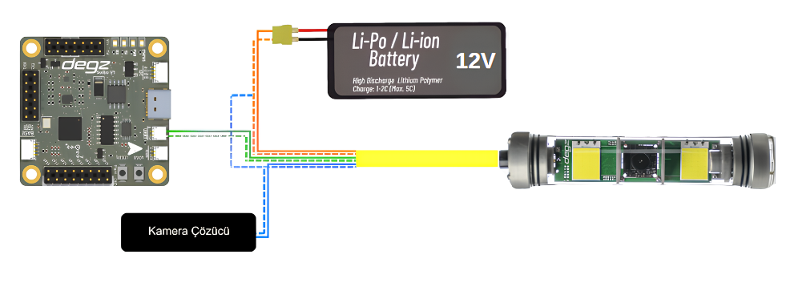

# Connection Diagram of the Product




The Roli Camera System is an extremely sensitive camera control system that offers impressive image quality even in the depths of the seas. In this system, the orange cable transmits 12V power as the positive power line to the camera, while the orange-white cable is used for reliable grounding (GND). Data communication occurs over the green Rx and green-white Tx lines; these lines facilitate serial data exchange between the control card and the camera module, meaning commands and responses within the system follow these routes.

The blue AV cable, which carries video signals for the camera, transfers the images to the Decoder card, while the blue-white provides the necessary ground connection for this function to be carried out stably. The system communicates using the UART protocol with a special packaging method, which regulates the data flow between the receiver and transmitter lines of the Roli Camera. Particularly important is that the GND line must be common among the system components during all these connections. This common ground connection ensures that all system elements share the same electrical reference point, making communication even more reliable.


## Rolica Camera Movement System Arduino Control Code

````
#include "SerialTransfer.h" // Includes the SerialTransfer library, simplifies serial communication.
#include "CommunicationPackets.h" // Includes the library defining special communication packets.

unsigned long lastUpdateTime, updateInterval = 50; // Holds the last update time and the update interval (in milliseconds).
SerialTransfer serialTransfer; // Creates a SerialTransfer object for serial communication.
RoliCam roliCam; // Creates a RoliCam object.

void setup() {
  Serial1.begin(9600); // Starts serial communication at 9600 baud rate.
  serialTransfer.begin(Serial1); // Initializes the SerialTransfer object with the specified serial port.
}

void loop() {
  unsigned long now = millis(); // Gets the current time in milliseconds.
  // If less time has passed than the specified update interval, skips the rest of the loop.
  if (now - lastUpdateTime < updateInterval) return;
  lastUpdateTime = now; // Updates the last update time to the current time.

  // Sets the camera angle and lighting level to specific values.
  // Repeats this process in a specific order and with delays.
  
  SetRoliCam(50,50);
  delay(150);
  SetRoliCam(50,0);
  delay(150);
  SetRoliCam(50,50);
  delay(150);
  SetRoliCam(50,0);
  delay(150);
  SetRoliCam(50,50);
  delay(150);
  SetRoliCam(50,0);
  delay(150);
  SetRoliCam(50,50);
  delay(150);
  SetRoliCam(50,0);
  delay(150);
  SetRoliCam(100,50);
  delay(1000);
  SetRoliCam(0,50);
  delay(1000);


  // Randomly generates an angle and lighting level and slowly moves the camera towards these values.
  /*
  int targetAngle = random(0, 181);  // Generates a random angle (between 0 and 180).
  int targetDim = random(0, 101);    // Generates a random lighting level (between 0 and 100).

  // Slowly moves the camera towards the target angle and lighting level.
  int deltaAngle = (targetAngle - roliCam.angle) / 10;
  int deltaDim = (targetDim - roliCam.dim) / 10;

  roliCam.angle = constrain(roliCam.angle + deltaAngle, 0, 180);
  roliCam.dim = constrain(roliCam.dim + deltaDim, 0, 100);
  
  uint16_t sendSize = 0;
  sendSize = serialTransfer.txObj(roliCam, sendSize);
  serialTransfer.sendData(sendSize);

  delay(500);  // Sets the necessary time for the camera to reach the desired position.
  */
}

void SetRoliCam(int targetAngle, int targetDim){
  // Slowly moves the camera towards the target angle and lighting level.
  roliCam.angle = constrain(targetAngle, 0, 180); // Limits the angle between 0 and 180 degrees.
  roliCam.dim = constrain(targetDim, 0, 100); // Limits the lighting between 0 and 100.

  uint16_t sendSize = 0;
  // Prepares the roliCam object for sending over the serial port and calculates its size.
  sendSize = serialTransfer.txObj(roliCam, sendSize);
  // Sends the prepared packet over the serial port.
  serialTransfer.sendData(sendSize);

}
````

### CommunicationPackets.h
````
#pragma once
struct __attribute__((packed)) RoliCam {
  int angle;
  int speed;
  int reset;
  int dim;
};
````


**You can reach us through the [forum](https://forum.degzrobotics.com/) for questions and suggestions**


