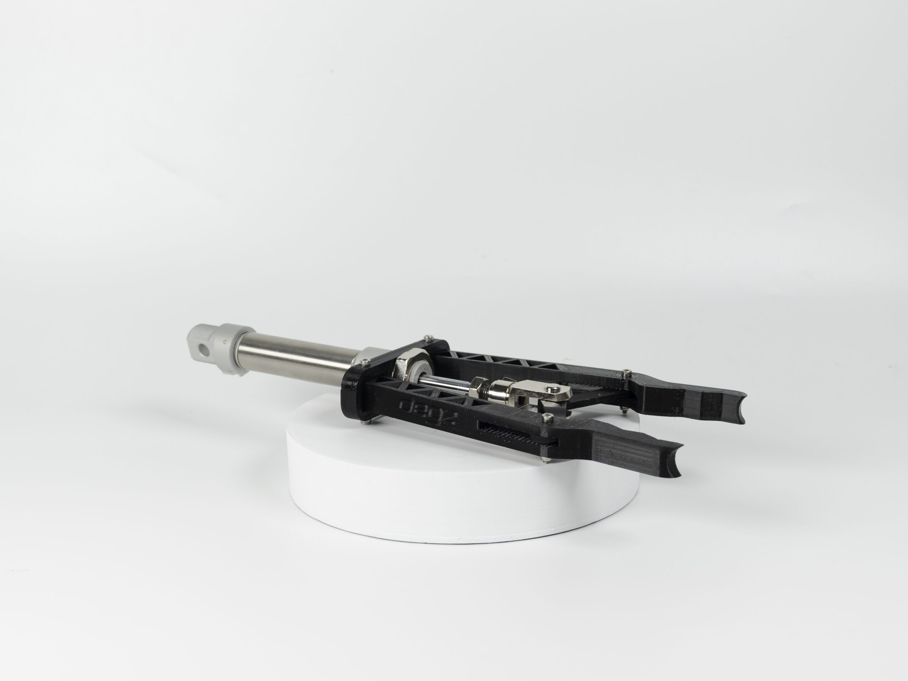

import DocCardList from '@theme/DocCardList';

# About the Product

The gripper arm required to perform underwater missions can be opened and closed in approximately 0.8 seconds. 

You can quickly pick up objects underwater. Easily grasping objects up to 10 cm in size, the arm can be used from land or underwater with a simple on/off signal. By adjusting the gripping intensity with pressure, you can hold delicate objects lightly or grasp heavy objects strongly.

# Product Technical Specifications

- Mouth opening : 120mm
- Length: Open 305mm, Closed 315mm
- Width 90mm  
- Holding force : Approx. 180Newton under 2.8 Bar pressure

## Use of the product

<iframe width="100%" height="574" src="https://www.youtube.com/embed/rv21GLY30Vw" title="180 NEWTON GRIP POWER | Degz Underwater Pinomatic Gripper Arm Reviewed !" frameborder="0" allow="accelerometer; autoplay; clipboard-write; encrypted-media; gyroscope; picture-in-picture; web-share" allowfullscreen></iframe>

<DocCardList />
