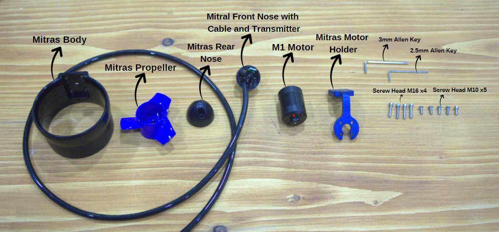
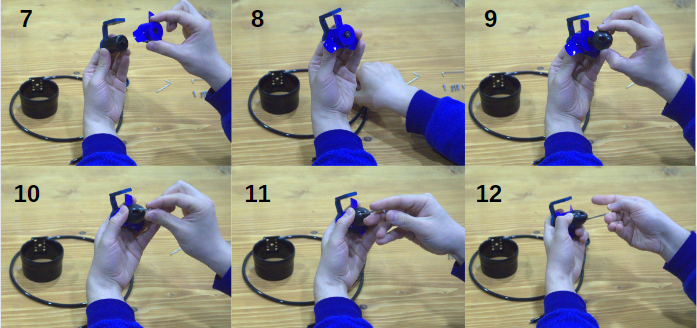

import DocCardList from '@theme/DocCardList';

# Assembling the Mitras Underwater Thruster

## Step 1: Motor Assembly
When we start assembling the motor, we first take our black M1 Motor and place it into the blue Mitras Motor Holder. When joining these two parts, we use only one screw of size M10x15. The screw is fixed by threading it through the hole in the body of the motor and the corresponding hole in the motor holder. When screwing in, we make sure that the screw is fully seated and that the motor is securely mounted in the holder. Thus, our motor is securely fixed to the holder and we are ready to move on to the next assembly steps.

## Step 2: Propeller and Rear Nose Assembly
Continuing with the assembly of our motor, we now attach the blue Mitras Propeller to the other end of the M1 Motor. We push the propeller onto the motor shaft. After the propeller assembly, we put the blue Mitras Rear Nose on it. While placing the rear nose on the engine body, we fix it to the engine body using two M10 size screws in accordance with the holes on both sides of the nose. When tightening these screws, we tighten each one carefully and with equal force so that there is no play between the parts. Once this step is completed, the propeller and the rear nose are securely mounted to the motor housing and we can move on to the next stages of assembly.

## Step 3: Body Mounting
At this stage of assembly, we mount the rear nose piece, which is assembled with the engine and propeller, to the large black Mitras Body. When assembling, we use the four predetermined screwing points on the Mitras Body. By placing four screws of M16 size in each point, we fix the motor-impeller-nose combination we prepared in advance to the fuselage. During the screwing process, we tighten the screws in a diagonal sequence, which is important to ensure even tension and avoid any warping. Once all the screws are properly and tightly installed, this step is complete and our motor is securely mounted to the fuselage. We are ready to move on to the next stages of assembly.

## Step 4: Front Nose Assembly
Now we come to the fourth step of our assembly process. To integrate the fuselage-engine-propeller combination we have created with the cable parts, we will use the Mitras Front Nose part with cable and transponder. We place this part on the front of the fuselage. After the Mitras Front Nose is placed on the fuselage, we fix it with two M10 screws on both sides of the part at the points of contact with the fuselage. During the screw placement process, we ensure that the front nose is firmly seated and fixed to the body by tightening both of the screws properly and evenly. Once this process is complete, the front part of our engine will have taken its place in the assembly process and we will be ready to move on to the next steps of our assembly.

## Step 5: Soldering Process
In this step, we move on to the soldering process to make the electrical connections. We solder to the solder pads on the solder pads on the M1 Motor, cable and Mitras Front Nose with transponder. While performing the soldering process, we use the soldering tool and solder wire. While doing this process, we need to be careful against overheating and excessive flow of solder wire that may occur during soldering. This is because the solder paths coming into contact with each other can cause unwanted electrical connections and short circuits. After soldering meticulously and cautiously, we make sure that the wires are correctly and reliably connected to the pads. After this successful operation, the electrical connections of our engine are complete and ready for the next assembly step.

## The Last Step Epoxy Insulation
We will now use epoxy resin to protect where we soldered. The epoxy will ensure that our electronics remain robust and safe. Before we start this process, we cover around the solder points with a transparent tape. The reason we use clear tape is to make sure that when we pour the epoxy, everything stays clean and you can see the resin drying. When the clear tape is glued to the soldered area, it will create a barrier so that when the epoxy is poured, it won't run off.

Once the tape is in place, we carefully pour epoxy over the solder points of our motor. This step allows us to make sure that all connections are secure and stay firmly in place. Once the epoxy has dried, our motor is ready to use and this is the final step in the assembly process.

**You can reach us through the [forum](https://forum.degzrobotics.com/) for questions and suggestions**